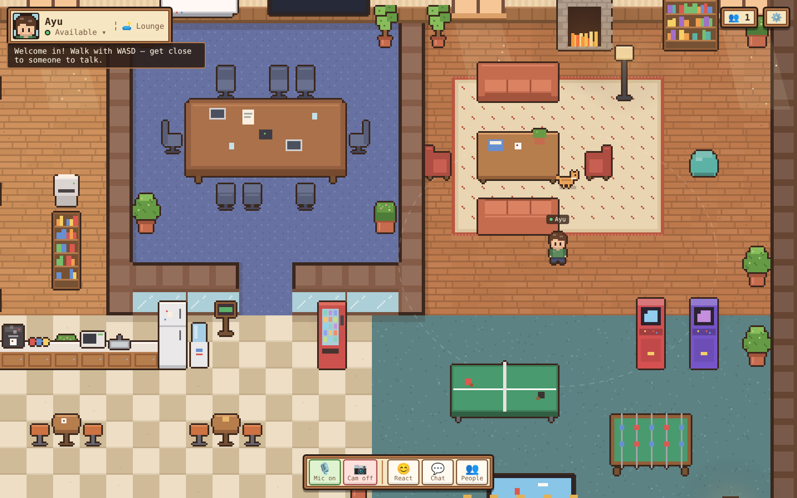

# Pixel HQ 🌿💻

A cozy, Stardew-style pixel-art virtual office for small dev teams (1–10 people) — Gather.town-style proximity voice, chat and meetings, running entirely in the browser.



## Features (MVP)

| | |
|---|---|
| 🗺️ **Office map** | Dev area (12 personal desks), shared workstations, glass meeting room, lounge with fireplace, coffee bar, game corner, entrance & garden path. All art is generated procedurally in code (no asset files). |
| 🚶 **Movement** | WASD / arrows, Shift to run, click-to-walk with pathfinding, depth-sorted rendering, collision. |
| 🌐 **Multiplayer** | WebSocket presence at 15 Hz with client-side interpolation; names, status dots and mic badges above heads. |
| 🪑 **Sitting** | `E`/`Space` near any chair, sofa, stool or bean bag (or click it). Monitors light up with scrolling code when someone sits at a desk. |
| 🎙️ **Proximity voice** | Mesh WebRTC: audio connects automatically within ~6 tiles, fades with distance, disconnects when you walk away. Voice-activity detection shows who is speaking. |
| 💬 **Chat** | Office-wide, Nearby (shows as speech bubbles) and private DMs. Emotes on keys `1`–`8`. |
| 📞 **Meeting room** | Walk in = join the call. Room-wide audio isolated from the rest of the office, camera tiles, screen sharing with a featured stage, *Leave* button. Door sign + wall TV light up when a meeting is live. |
| 🟢 **Status** | Available / Busy / Away (auto after 5 min idle). Busy & Away pause proximity audio (meetings still work). |
| ✨ **Details** | Day/night window sky and tint from your local clock, light beams with dust motes, steaming coffee machine, crackling fireplace, blinking server racks, arcade & TV animations, a wandering office cat. |

## Run it

```bash
npm install
npm run dev          # server :3001 + Vite :5173 → open http://localhost:5173
```

Production (single port, serves the built client + WebSocket on `/ws`):

```bash
npm run build && npm start      # http://localhost:3001
# or
docker compose up --build
```

> **HTTPS is required** for microphone/camera anywhere except `localhost`. Put it behind Caddy/Nginx/Cloudflare Tunnel with TLS (WebSocket upgrade on `/ws` must be proxied).

### Environment

| Variable | Default | |
|---|---|---|
| `PORT` | `3001` | HTTP + WS port |
| `MAX_PLAYERS` | `16` | Office capacity |
| `ICE_SERVERS` | Google STUN | JSON array of RTCIceServer. **Add a TURN server** (e.g. coturn) for users behind corporate/symmetric NAT. |
| `STATIC_DIR` | `client/dist` | Built client location |

## Controls

`WASD`/arrows walk · `Shift` run · click floor to walk · `E`/`Space` sit/stand · `Enter` chat · `Esc` back to game · `1–8` emotes · `M` mute · `V` camera · click a person for DM / walk-over / wave.

## Architecture

```
shared/protocol.ts        typed wire protocol + constants (used by both sides)
server/src/index.ts       Node + ws: presence, 15 Hz movement snapshots, chat routing
                          (global / nearby by distance & room / DM), rate limit,
                          WebRTC signaling relay, heartbeat, static hosting
client/src/
  game/
    map.ts                office layout: floors, walls, furniture, seats, zones, collision grid
    pixel.ts              pixel toolkit (auto-outline, shading, deterministic noise)
    art/tiles.ts          bakes floors/walls/rugs/wall decor into one static canvas
    art/furniture.ts      procedural furniture sprites + per-frame animations
    art/character.ts      palette-swappable character sprite sheets (4 dirs, walk/sit/blink)
    engine.ts             game loop: input, collision, seats, click-to-walk (BFS),
                          interpolation, camera, y-sorted rendering, name tags & bubbles
    input.ts              keyboard (ignores typing in inputs)
  net/socket.ts           WebSocket client → store/live state
  rtc/media.ts            mic (+voice activity detection), camera, screen share
  rtc/peers.ts            proximity/meeting mesh: 3 fixed transceivers per peer
                          (mic, cam, screen) → toggles use replaceTrack, no renegotiation
  state/store.ts          Zustand store for UI (presence, chat, toggles, settings)
  state/live.ts           mutable per-frame positions & bubbles (kept out of React)
  ui/                     React HUD: join screen, player card, dock, chat, people,
                          media strip / meeting stage, settings, toasts
```

**Voice model.** Each pair of players has at most one `RTCPeerConnection`, opened while they should hear each other: both in the meeting room, or both outside it, both *Available*, and within `VOICE_RADIUS` (with hysteresis to avoid flapping). The player with the smaller id always offers, so there's no glare. Volume follows distance via the `<audio>` element.

**Scaling notes.** A full mesh is ideal for ≤10 people (each user uploads one stream per neighbour). For bigger offices or large meetings, swap `rtc/peers.ts` for an SFU (LiveKit / mediasoup) — the rest of the app doesn't care. Server state is in-memory (single office, single process); add Redis pub/sub if you need multiple instances or rooms.

## Ideas for next steps

Persistent desk ownership & name plates · multiple floors/rooms via `?office=` · SFU for meetings · Tiled (`.tmj`) map import · auth (Google / magic link) · Slack/Calendar status sync · whiteboard object you can draw on together · mobile touch joystick.
